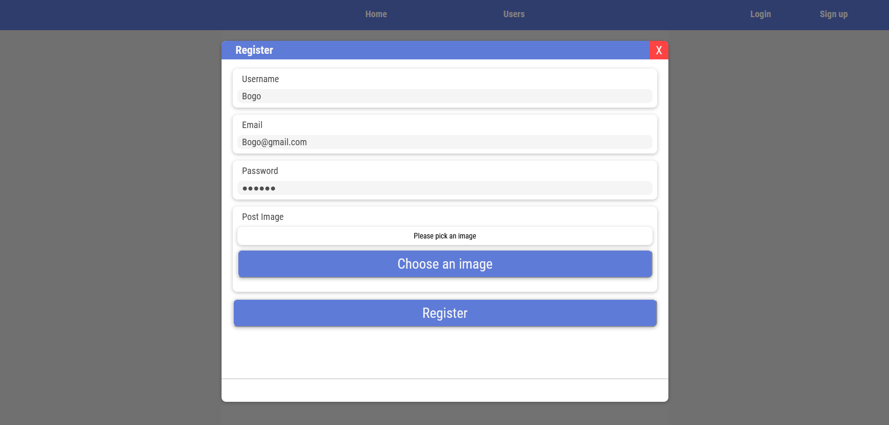
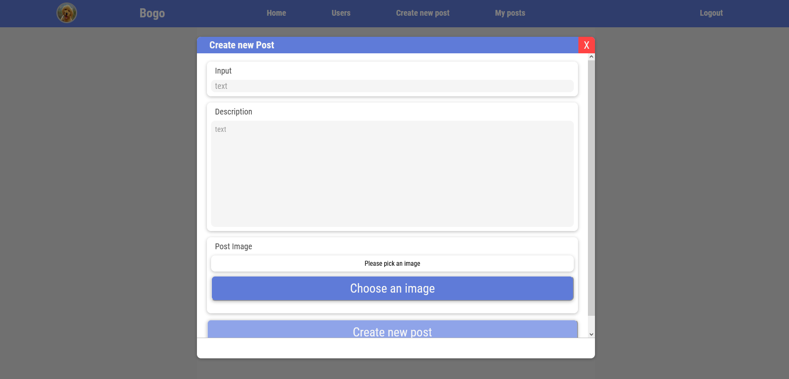
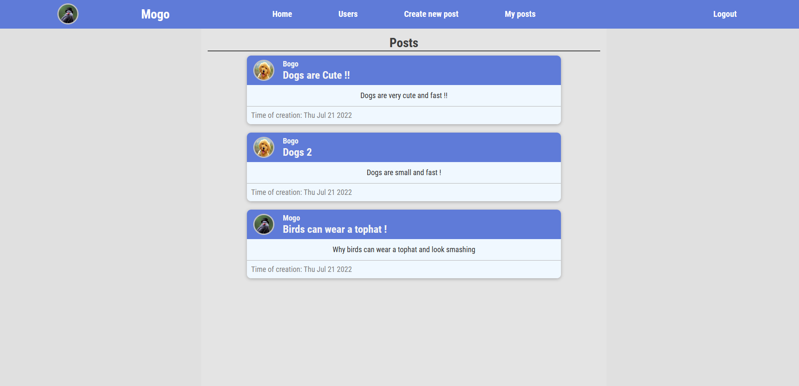
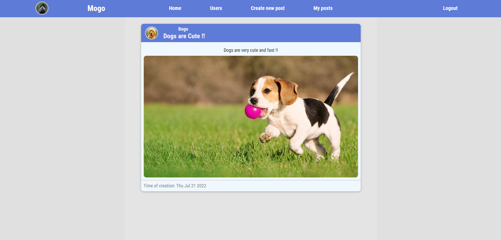
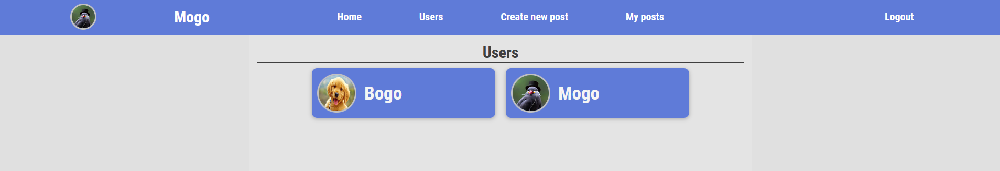
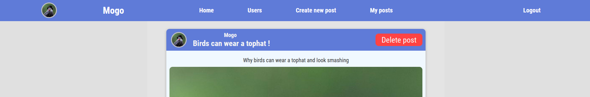
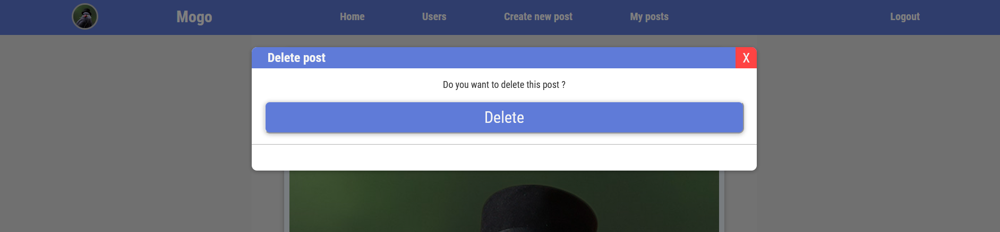

# What is it ?
Its a simple """""blog"""" app created using MERN stack => MongoDB, Express.js, React.js and Node.js 
Everything writen in Typescript

## Users can:
- Register, Login
- Create new posts with pictures
- Delete posts 
- Look at posts of other users

### Libraries/framewokrs used
-     "bcrypt": "^5.0.1",
-     "body-parser": "^1.20.0",
-     "dotenv": "^16.0.1",
-     "express-validator": "^6.14.2",
-     "jsonwebtoken": "^8.5.1",
-     "mongoose": "^6.4.3",
-     "mongoose-unique-validator": "^3.1.0",
-     "multer": "^1.4.5-lts.1",
-     "nodemon": "^2.0.19",
-     "ts-node": "^10.8.2",
-     "uuid": "^8.3.2"

Some pics of final project 

